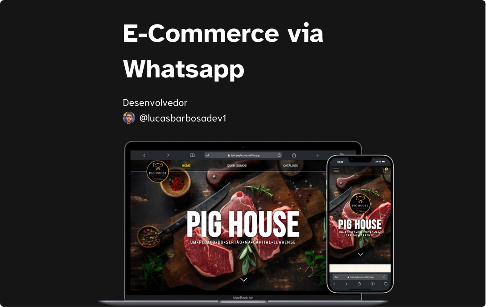

<h1 align="center">
    
</h1>

<h3 align="center"> 
  🚧 E-Commerce via Whatsapp 🚧
</h3>

 <a href="#-sobre-o-projeto">Sobre</a> •
 <a href="#-funcionalidades">Funcionalidades</a> •
 <a href="#-tecnologias">Tecnologias</a> • 
 <a href="#-contribuidores">Contribuidores</a> • 
 <a href="#user-content--licença">Licença</a>

## 💻 Sobre o projeto

📄 E-commerce de uma loja de carnes artesanais com finalização de compra via whatsapp.

---

## ⚙️ Funcionalidades

- [x] Funcionalidades:
  - [x] Menu de navegação.
  - [x] Adição e subtração de produtos no carrinho de compras.
  - [x] Redirecionamento para redes sociais.
  - [x] Finalização da compra com extrato via whatsapp.

---

## 🛣️ Visualização da aplicação no ar

[Pig House](https://test-pighouse.netlify.app/)

---

## 🛠 Tecnologias

As seguintes ferramentas foram usadas na construção do projeto:

-   **HTML**
-   **SASS**
-   **Typescript**

---

## 👨‍💻 Contribuidores

<table>
  <tr>
    <td align="center"><a href="https://www.linkedin.com/in/lucasbarbosadev1/"> <b>Lucas Barbosa</b></a> <a href="https://www.linkedin.com/in/lucasbarbosadev1/" title="Cubos Academy">👨‍💻</a></td>
  </tr>
</table>

---

## 📝 Licença

<!-- Este projeto esta sobe a licença [MIT](./LICENSE). -->

Feito com ❤️ por Lucas Barbosa 👋🏽 [Entre em contato!](https://www.linkedin.com/in/lucasbarbosadev1/)
